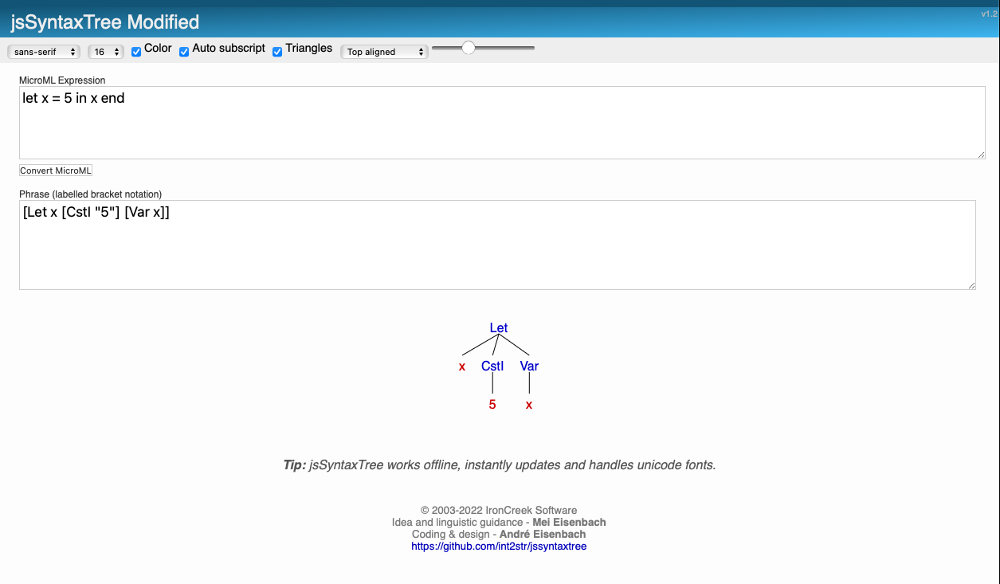

# MicroML AST Viewer

A single-page .NET web application that parses MicroML expressions into an abstract syntax tree (AST) and renders it in the browser using jsSyntaxTree.

## Features

- Accepts MicroML code via a user input form.
- Sends the expression to a Giraffe F# backend for parsing.
- Converts the code into bracket-notation AST.
- Renders the AST in the browser using jsSyntaxTree.

## Prerequisites

- [.NET 6 SDK](https://dotnet.microsoft.com/download) or later.
- A modern web browser (Chrome, Firefox, Edge, or Safari).

## Getting Started

1. **Clone the repository**  
   ```bash
   git clone https://github.com/your-username/project3-zach-stucky.git
   ```

2. **Restore and build**  
   ```bash
   dotnet restore
   dotnet build
   ```

3. **Run the application**  
   ```bash
   dotnet run
   ```
   By default, the app listens on `http://localhost:5000`.

4. **Open in browser**  
   Navigate to `http://localhost:5000` to access the MicroML AST Viewer.

## Usage

1. Enter a MicroML expression in the **MicroML Expression** textbox.
2. Click **Convert MicroML** to send it to the backend.
3. The bracket-notation AST will appear.
4. Click into the Phrase text box and press space.
5. The syntax tree will render below. 

## Screenshot


## License

This project is licensed under the MIT License. See [LICENSE](LICENSE) for details.